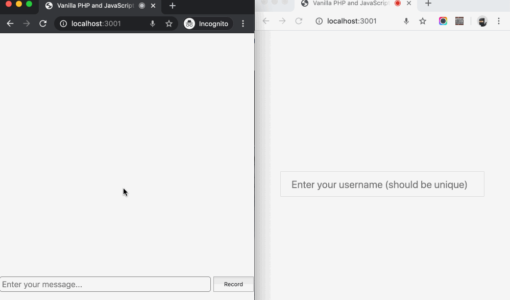

# How to integrate voice messages into your Stream chat application

This is a sample application that shows you how to integrate a voice message feature into your Stream Chat app. You can read more about how it was build [here]()



## How to install

To get this app up and running on your local machine, follow the below instruction:

1. First, [register](https://getstream.io/chat/) an account on the Stream website to get an API key. Copy your `APP ID`, `API KEY`, and `API SECRET` after successful registration.

Then:
  - Open up the `server.js` file and replace the `<STREAM_API_KEY>` and `<STREAM_API_SECRET>` placeholders with their correct API keys you just copied.
  - Open up the custom.js file and replace the `<STREAM_API_KEY>` with its correct detail.

2. Next, clone this project to your local machine

```bash
git clone https://github.com/dongido001/stream-voice-message.git
```

3. `cd` into the project root folder and install all dependencies:

```bash
cd stream-voice-message && npm install
```
4. Start up the development server:

```bash
node server.js
```

5. Start chatting! visit the app at [http://localhost:3000](http://localhost:3000)